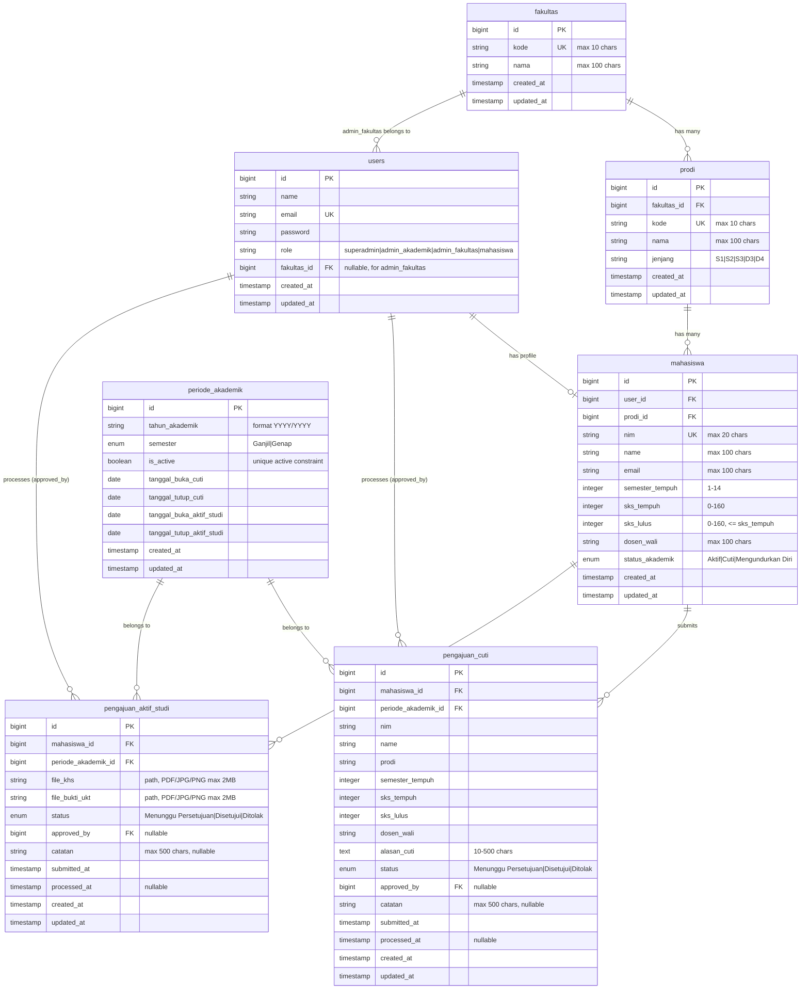

# ERD - Sistem Cuti Mahasiswa & Aktif Studi

## Penjelasan Relasi

| Relasi | Keterangan |
|--------|-----------|
| `fakultas` → `prodi` | One-to-many. Satu fakultas memiliki banyak program studi |
| `fakultas` → `users` (admin_fakultas) | One-to-many. Admin fakultas terikat ke satu fakultas |
| `prodi` → `mahasiswa` | One-to-many. Satu prodi memiliki banyak mahasiswa |
| `users` → `mahasiswa` | One-to-one. Setiap mahasiswa punya 1 user account |
| `mahasiswa` → `pengajuan_cuti` | One-to-many. Mahasiswa bisa punya banyak riwayat cuti |
| `mahasiswa` → `pengajuan_aktif_studi` | One-to-many. Mahasiswa bisa punya banyak riwayat aktif studi |
| `periode_akademik` → `pengajuan_cuti` | One-to-many. Setiap pengajuan terikat 1 periode |
| `periode_akademik` → `pengajuan_aktif_studi` | One-to-many. Setiap pengajuan terikat 1 periode |
| `users` → `pengajuan_cuti` (approved_by) | Admin yang memproses pengajuan |
| `users` → `pengajuan_aktif_studi` (approved_by) | Admin yang memproses pengajuan |

## Constraint Penting

- `fakultas.kode`: unique
- `prodi.kode`: unique
- `periode_akademik`: unique composite pada (`tahun_akademik`, `semester`)
- `mahasiswa.nim`: unique
- `mahasiswa.sks_lulus` <= `mahasiswa.sks_tempuh`
- `pengajuan_cuti`: max 2 record dengan status "Disetujui" per mahasiswa
- `pengajuan_cuti`: tidak boleh ada 2 record "Disetujui" di periode berturutan
- `users` dengan role `admin_fakultas` wajib memiliki `fakultas_id`
- Admin fakultas hanya dapat memproses pengajuan dari mahasiswa di fakultas yang sama
